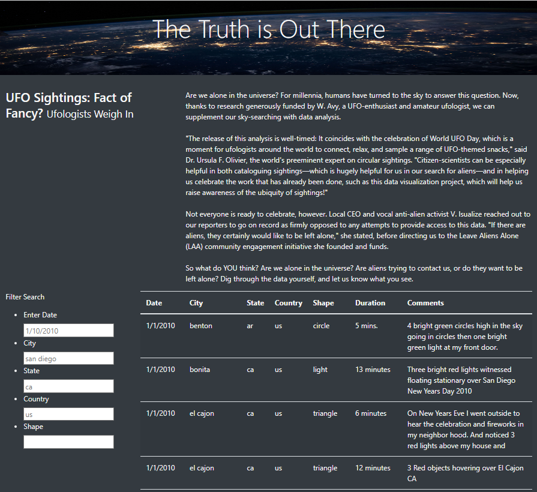

# UFO Sightings

## Overview of Project: 
UFO Sightings website is built to allow users easy access to the database of UFO sightings and provides an ability to filter for multiple criteria at the same time for an in-depth analysis. 

## Results: 

Users have the ability to hone in on the data by filtering the UFO sightings by 5 criteria:
- Date
- City
- State
- Country
- Shape

To filter the data, the user will need to enter the desired criteria into the filters on the left-hand side. By default the filters are set to the following criteria: 
- Date: 1/10/2010
- City: san diego
- State: ca
- Country: us

Please note that the filters are case sensitive and all the search criteria have to be low case. If you type in "San Diego", you will not get any records.

## Summary: 

### Limitations of the website
While this is a good start for this project, it has some limitations. One drawback is that the filters are case sensitive and the searching criteria has to be entered in a certain way. This is going to cause a lot of frustrations for the end user.

Another large limitation is that currently there is no way to export the data and the biggest value of data comes from being able to export and analyze it in external tools (excel, python, etc).

We can address these issues in the next website update.

### Next Steps

To address existing limitations, we can take the next steps:

1.  Sanitize our inputs:
    - transform all user inputs to lower case
    - validate the date to be in a valid date format

2. To take this a step further we can update the input prompts:
    - add calendar for picking the dates
    - add drop down lists for countries, states, cities and shapes and include intelligent prompts that would autopopulate as the user starts typing. 

        This is especially critical for the "Shape" filter as it's unclear what values are available for input. For example, one of the "shapes" in the dataset is "light" which is not intuitively thought of as a shape.

2. Add the ability to export the data.